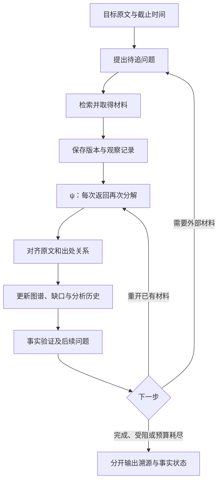

# Accuracy Tracing：溯源双回环定稿与全指标验收规范

> v0.3 update: [REPAIR_V0.3.md](REPAIR_V0.3.md) supersedes conflicting implementation and adapter notes below.

版本：0.2.0 · 日期：2026-09-05 · 状态：架构定稿、离线参考实现已开始执行。

## 1. 定论及其边界

本项目采用“每次材料返回都重新分解”的溯源回环，并连接独立的事实验证回环。反馈对象包括原材料、已有分解、来源关系、版本信息和未解决问题。验证发现的新缺口也必须经检索、材料保存、再次分解之后才能影响结果。

溯源需要重建一条具体说法或一份素材的产生、加工和传播关系，并为每个关系留下可复查依据。可检索范围内的最早版本、直接原始材料和底层数据可能是不同对象。系统分别记录它们，按目标片段判断完成程度。

**设计结论已经明确；真实新闻准确率提升尚未得到实测证明。** 当前代码验证的是循环编排、数据契约、指标计算和受控的合成场景。默认分解器保守保留原文；演示使用预先写好的语义标注。它们不等同于接入了真实新闻检索、通用语义模型和独立人工审定集的生产系统。

项目名为 `accuracy tracing`，Python 包继续使用 `newsverify`。当前交付可直接交给 Codex 接着执行。截图中的应用项目归属没有可用写入接口，本次没有声称已经移动聊天、在另一聊天发送消息或修改用户电脑的全部设置。

## 2. 不可变的目标与可修订的理解

目标原文与其 ID 保持不变。上游材料说法不同，新增一条带原文位置的记录，并追踪两者的关系。模型把原目标读错时，可以修订理解，但不能覆盖原新闻使问题消失。

每个片段保留：主体、动作、对象、数量及分母、时间、否定、条件、语气、说话者、引用范围、父级片段和原文位置。数量必须与其修饰对象一起保存；“最多降低30%外包预算”不能变成“裁员30%”。语义模型以后需要显式验证这些依赖，当前默认原文保留器不声称已能自动完成细粒度理解。

维护两种结构：

1. **说法分解结构**：内容如何分片、限定词作用于哪里，以及分片出现在哪个原文版本。
2. **来源关系结构**：材料、责任主体、加工活动及其引用、转载、翻译、派生和修订关系。

“某材料支持一句话”与“下游实际引用某材料”分别记录。相似文字、时间更早或同一数字只能形成候选；它们不足以单独证明传播关系。

## 3. 八个工作板块

| 板块 | 必须完成的工作 | 输出 |
|---|---|---|
| 目标界定 | 固定说法、片段范围、调查截止时间与原始出处层级 | Target 与任务约束 |
| 材料与版本 | 保存取得的内容、地址、版本身份和观察记录 | MaterialVersion、原文锚点 |
| 再次分解 | 每次返回重新提取说法、限定、归属和来源线索 | Analysis、Fragment |
| 来源候选 | 形成直接引用、共同上游、独立取得等可区分解释 | 带状态和依据的 Relation |
| 时间核对 | 分离事件、发布、更新、版本可取得及检索时间 | 历史合格性与不确定部分 |
| 图谱修订 | 重开受到新材料影响的旧分析，保留变更历史 | 当前图与历史分析 |
| 事实验证 | 检查支持、反证、同源依赖和证据缺口 | 独立事实状态与新任务 |
| 调度及验收 | 按问题安排下一轮，记录成本与停止原因 | 审计轨迹、指标和报告 |

该结构参考 W3C 对材料、活动、参与者与派生关系的建模；具体新闻算法及下面的分数是本项目设计。[PROV-DM](https://www.w3.org/TR/prov-dm/)

## 4. 运行流程

每个正常返回的材料版本都经分解，比对重复项也有记录。类型错误和版本 ID 冲突先产生完整性错误，不能继续作为有效材料。已知时间不合格的材料保留在观察记录中，不进入合格证据图和验证器。

一次再次分解处理三件事：材料内容、它与目标各片段的关系、它对旧分解和旧关系的影响。`revisit_versions` 可指定需要重开的旧版本；新分析替代该版本的当前分析，旧分析保留在历史中。

调度检查新的材料和实质结构变化。重复材料若产生新关系或新缺口，可以继续；反复出现同一结构、空返回或预算耗尽则明确停止。轮数、材料数、分解次数分别限量。实时网络超时、模型 token 账单与实际耗时的强制执行仍由未来适配器实现。

当前调度器按缺口列表向 provider 提交任务，并执行重分解与重开请求。下一步选择“最能区分竞争来源解释的查询”的策略由适配器承担；参考实现没有伪装成已训练好的信息增益搜索模型。

## 5. 来源关系、时间和完成标准

关系状态使用 `direct / declared / inferred / unresolved / excluded`。每条关系至少保存来源片段、类型、依据和解释。直接关系需要取得被引用版本；匿名采访可以保存发布者声明，底层记录缺失仍保留缺口。

同一 URL 的不同内容使用不同版本 ID。同一 ID 对应不同内容或身份元数据为完整性错误。重复检索时间是观察记录，不应制造一个新的发布者版本。内容指纹只能识别所保存版本的变化，不证明材料本身为真。

`published_at` 单独不证明该确切版本在过去已存在。历史合格性需要 `available_at` 与依据；检索可以晚于调查截止点，但需要确切旧版本的可核查记录。旧原始文件没有任意72小时淘汰规则。来源材料的生成与后续使用关系也需要时序检查。[PROV 约束](https://www.w3.org/TR/prov-constraints/)

**当前历史隔离的限制：**调度器排除不合格版本进入图和验证器，但插件可能有内部状态，模型也可能在训练中见过后续信息。严格历史评测还需要隔离不合格材料的语义调用、保证适配器只使用截至当时的材料，并记录模型和知识截止限制。当前通过的时间测试只证明编排规则，不能证明完整系统没有未来信息泄漏。

溯源状态和事实状态分别输出。参考实现的 `original_material_located` 要求插件提出带原文依据的原始材料认定、从 `Target.source_version_id` 有直接引用或派生路径通往该材料，并且没有未解溯源任务。支持/反对关系不参加来源路径遍历。这仍属于插件驱动的调查结果；关系语义是否认对，由独立 gold 的 SR 和路径评分检验，不能由运行器的完成标记自证。

## 6. 全部七项主指标

统计单位是**人工预先固定的目标说法**。所有预测必须覆盖同一组 ID，不允许漏掉难例、加入简单分片稀释分母或重复输出加分。标签与预测分别提供；用于评分的材料集合经过独立审定，新增未审定材料必须先标注再评分。

标签为截至指定时点的 `true / false / disputed / unverifiable`。有误导性质的说法必须在标注规则中明确如何归类，不能把所有争议信息都当假新闻。`decision=true` 表示进入可信流；其余状态不进入可信流。

| 指标 | 固定定义 | 方向 |
|---|---|---|
| VP 可信流精确率 | 进入可信流且 gold=true 的目标数 / 所有进入可信流的目标数 | 越高越好 |
| FR 虚假拦截率 | gold=false 且未进入可信流的目标数 / 所有 gold=false 目标数 | 越高越好 |
| TR 真实放行率 | gold=true 且进入可信流的目标数 / 所有 gold=true 目标数 | 越高越好 |
| SR 原始出处成功率 | 正确给出原始材料集合及有效路径的目标数 / gold 中可追到原始出处的目标数 | 越高越好 |
| EN 支持证据精确率 | 声称 supports 且 gold 认定 supports 的证据条数 / 所有声称 supports 的证据条数 | 越高越好 |
| CA 概率质量 | 1 − 四分类 Brier score / 2 | 越高越好 |
| HFAR 高风险假新闻误放率 | 高风险且 gold=false、被放入可信流的目标数 / 所有高风险 gold=false 目标数 | 越低越好 |

SR 的一次成功要求：预测的根源集合恰好匹配 gold 允许的一组答案；每个根源都有从目标出发的有效引用或派生路径；报告的确定边不能夹带无依据的额外关系。允许多个等价可接受根源集合，也允许一个目标需要多个根源。仅给出正确网址却没有来源路径不算成功。

CA 用全部四类概率计算：

\[
BS=\frac{1}{N}\sum_{i=1}^{N}\sum_{k=1}^{4}(p_{ik}-\mathbf{1}[y_i=k])^2,
\qquad CA=1-\frac{BS}{2}.
\]

四分类 Brier 的范围为0到2。它同时反映概率预测的校准和区分能力，所以 CA 在本规格中称“概率质量”，不能直接声称是纯校准。额外报告10个等宽置信度区间的 top-label ECE 与每个区间样本数；并列最高概率按标签固定顺序处理。概率质量评估使用预测分布，可信流评估使用最终策略决策，两者可以因弃权阈值不同。[Brier 定义](https://scikit-learn.org/stable/modules/generated/sklearn.metrics.brier_score_loss.html)

任何比例分母为0都返回 `null`。任何目标缺少概率输出，主 CA、ECE 和综合分都不计算；不把缺失概率补成一热向量。非法概率、重复样本、时间截止点不匹配或未审定证据会使评分输入无效。

## 7. 防止总分掩盖问题的配套指标

EN 从截图的混合定义中拆出“证据支持”。同源判断单独评分，不应把两种错误揉成一个无法诊断的数字。

| 配套指标 | 作用 |
|---|---|
| 来源认定精确率 | 正确认定 / 所有声称找到原始材料的目标，发现乱认源头 |
| 未知源错误升级率 | gold 无法确认源头却被报为 resolved 的比例 |
| 引用边精确率及已标注边召回率 | 检查路径中的每一段；边召回是诊断项，不要求必须走完所有可选路径 |
| 支持证据召回率 | 避免只交一条简单证据取得高 EN |
| stance accuracy | 单独检查 supports/contradicts/neutral 对齐 |
| 同源对 F1 | 按两份材料是否同一上游来源计 TP、FP、FN，分组名称本身不参与匹配 |
| 假新闻明确识别召回率 | 区分“认定为假”与“尚未核实所以暂不放行” |
| 分类混淆矩阵与可信流覆盖率 | 防止一律不放行产生表面高拦截率 |
| ECE10 与分箱计数 | 检查置信度分布和预测正确率是否匹配 |

同源对统计使用固定已审定材料集合；遗漏同源材料会留下 FN。没有正例对且没有预测同源对时 F1 为未定义，不记满分。一个机构内的不同采访也不能仅因同一域名就自动合并为同源。

## 8. 综合指数的使用方式

保留另一聊天截图的权重，命名为 **NVScore-v0.2-experimental**：

\[
NVScore=100\,VP^{0.25}FR^{0.20}TR^{0.15}SR^{0.15}EN^{0.15}CA^{0.10}(1-HFAR)^2.
\]

它是待验证的项目内比较指标。权重和平方惩罚是事先登记的设计选择，不是实验已经证明的最佳配置，也不是 Terminal-Bench、官方新闻基准或任何项目申请的通过分数。任何主指标缺失则综合分不计算，不进行权重重分配。

FR 高但 TR 低、EN 高但支持证据召回低、SR 高但未知源错误升级率高，都不能因总分好看而忽略。正式上线阈值需要根据使用场景和独立验证集制定。当前没有编造一个通用“超过某分就可靠”的门槛。

## 9. 等预算实验与统计验证

最终实验固定同一模型版本、同一材料快照、同一组目标、同一截止时间以及每目标的检索次数、模型 token、时间上限。先预登记系统变体：

1. 单次分解、单次检索基线。
2. 固定初始分解、多轮检索。
3. 每轮重新分解的溯源回环。
4. 溯源回环加独立事实验证及其缺口反馈。

第3组对第2组检验“再次分解”的增益，第4组对第3组检验第二回环的增益。允许预算上限内使用量不同；报告实际用量。分解、检索查询生成、验证和重试使用的 token 都要计费，不能只给候选系统额外免费调用。

`compare` 已实现：检查相同模型、材料集合 ID、预算声明及完整用量日志；对成对目标按事件组重采样，输出所有指标差值和事件聚类 bootstrap 区间。它检查输入声明，不能独立证明外部服务真的按声明执行。

比例报告提供95% Wilson 参考区间；多条同事件或同源样本不独立时，以事件聚类实验为主。[Wilson 区间](https://itl.nist.gov/div898/handbook/prc/section2/prc241.htm)

bootstrap 预设固定随机种子。任何重采样导致某指标未定义，该指标区间标记不可计算并显示有效次数；不悄悄丢弃失败样本给出偏向乐观的区间。事件数过少不作稳定性结论。当前区间是探索性逐项区间，若宣称全部七项同时改善，需要预登记主次指标和多重比较处理。

## 10. 数据集与发布验收

真实新闻评估需要独立审定标签、材料版本和来源路径，并按事件和时间分离训练、开发与隐藏测试。标注者需要记录“为何可确认/为何暂不可确认”，遇到不同意见保留仲裁记录。测试集不能由同一模型自动给自己生成标准答案。

至少包含：引用链、共同上游、循环引用、同网址改稿、旧原件、缺失原件、匿名来源声明、错误归因、跨语言转述、数字分母变化、限定词丢失、争议与暂不可核实样本。音视频/OCR/图像来源需要专门适配器和独立标注，当前文本演示不能覆盖这些能力。

发布前分四类报告：代码契约是否通过；指标算术是否正确；在隐藏真实新闻集上的效果；成本、延迟、失败恢复和长期运行表现。前三者中的任意一项不能替代其余项。

## 11. 本次实现与后续步骤

本次已实现：版本化材料、可插拔分解器/验证器、每次返回再次分解、旧材料重开、来源与事实状态分离、验证缺口反馈、预算及停止轨迹、七项指标和配套诊断、等预算声明核对、事件聚类差值评估、CLI、合成演示与测试。

后续仍需：真实新闻 provider、通用结构化语义分解/验证模型、模型输出到评估 schema 的严格导出器、时间隔离、运行成本的实际计量、人工审定集、隐藏集实验和上线参数选择。执行顺序、接口、停止条件及交接指令见 `CODEX_EXECUTION_PLAN.md`。本次测试数字和实际命令记录见 `../reports/VALIDATION_V0.2.md`。
