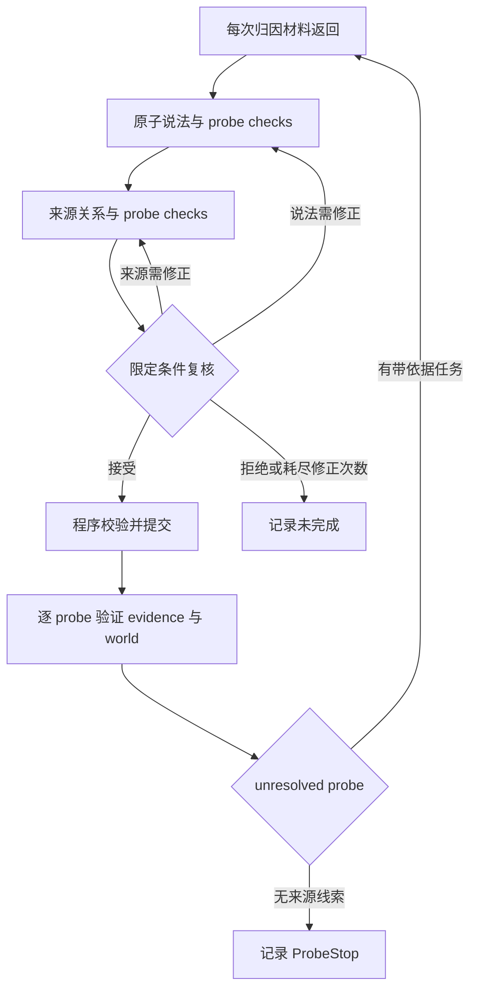

# 分阶段 ψ 与定向反馈回环

实现：`experiments/staged_semantic.py`。每次材料返回仍进入 ψ，目标文本、时间截点、证据范围保持不变。模型分阶段理解材料；程序生成编号、定位原文、登记缺口并提交通过校验的状态更新。

可选的目标延伸层由 `experiments/extended_semantic.py` 实现。新的运行使用 `decision-probe-v4`：先把 immutable target 拆成说法契约，用 deterministic segment ledger 检查显式漏维度，再生成分阶段判定探针。v4 以只绑定谓词的 `predicate_core` 加每个说法恰好一个 composition gate 代替职责过载的历史核心探针，并把 `actor_role`、`location` 与 `entity_identity` 分成正交变量。evidence/world 为每个探针输出带原文依据的状态，Python 按冻结目标逻辑聚合，最后执行定向判定复核。完整契约见 `docs/TARGET_EXTENSION.md`；运行时使用 `--target-extension`。

| 阶段 | 输入与职责 | 输出 | 不通过时 |
|---|---|---|---|
| atoms | 当前材料、该阶段 probe 投影与本次 retrieval attribution | 至多 6 个原子说法；每个 probe 一个 `addressed/absent/ambiguous` check | 引用、finding 索引或 probe 覆盖无效则整层重做 |
| lineage | 当前材料、可访问材料、lineage probe 投影与 retrieval attribution | 至多 4 个显式引用、可为空的 origin；每个 probe 一个 check | 保留缺失上游为缺口，不编造来源或 origin |
| critic | 原文、两个完整草稿、旧分析、probe checks 与当前材料相关的验证反馈 | 接受；指定 atoms/lineage 修正；拒绝 | 带唯一原文引用和具体问题退回对应阶段 |
| 程序装配 | 被接受的两个草稿、版本与缺口登记表 | 完整现行 Analysis | 校验失败不提交；上次有效状态保留用于审计 |
| evidence | 固定证据范围内材料、片段与 evidence probes | 每个 probe 的依据和状态；Python 聚合 | 每个 unresolved probe 恰好给一个带 lead 的任务或 `no_source_lead` |
| world | 可访问材料、来源关系、origin 与 world probes | 每个 probe 的现实层依据和状态；Python 聚合 | 每个 unresolved probe 恰好给一个带 lead 的任务或 `no_source_lead` |



图中返回某阶段表示只重做被点名的完整阶段，另一个草稿保留，再复核两者一致性。每次新材料返回都必须进入 atoms → lineage → critic；只有显式 `reanalyse` 才允许重复版本再次进入 ψ。没有 provider return 时不会凭空重跑 ψ 或 verifier。默认每次 ψ 至多一次定向修正；复核仍拒绝就明确失败，不把失败改成“无法判断”冒充完成。真实外层运行另有轮数和总预算限制。

提示词分别对应 `ATOMS_PROMPT`、`LINEAGE_PROMPT`、`CRITIC_PROMPT`、`EVIDENCE_PROMPT`、`WORLD_PROMPT`，完整内容与严格 JSON schema 均在实现文件中。v4 的 atoms/lineage schema 要求投影中每个 probe 恰好一个 `probe_check`，每个返回 finding 也必须被至少一个 check 引用；这只是当前材料的处理账本，不把 target plan 当成证据。限定短语在其所属原子说法的引用内定位：例如同一年份在文章里重复出现，只要在选中的父引用内唯一，就可确定位置。两个不同的原子说法可以引用同一句话。

稳定编号由材料版本与内容生成。新分析完整替换当前材料的分析；旧分析保留在历史中。仍有依据的发现需要重新确认，无依据的发现可以撤回。跨材料引用允许，但不同所有者的冲突定义会被拒绝；缺口登记表约束引用范围和生命周期。v4 的 unresolved probe 必须在本轮输出一个带正文 lead 的 `fetch/search/reanalyse`，或一个 `no_source_lead` 停止项，二者严格 XOR。同一 `(evidence/world, probe_id)` 若产生新的任务 ID，新任务原子替代旧 active task；旧项保留在 registry/history，记录 `superseded_prior_gaps`，不伪造 Resolution。被替代的 ID 成为永久 tombstone，检查点恢复后也不能重新激活；跨 layer 的同名 probe 不互相替代。旧 v1 检查点缺少历史登记信息，需要重新生成 v2 的有效首轮。

## 固定控制臂与任务路由臂

`fixed_reanalysis` 是历史控制臂：每轮按固定顺序、在文档容量上限内从头重放 eligible snapshots，用来观察同一 v4 语义合同在“固定材料反复可见”条件下是否跑通。它不会宣称这些材料是由当前缺口检索得到；配置中的 retrieval attribution mode 为 `legacy`，运行报告写为 `legacy-compatible`。

`task_routed` 是实际回环臂，并强制 strict retrieval attribution。首轮 provider 只返回 `target.source_version_id`，包装为 `RetrievalHit`，且只归因给本轮 `origin:<target_id>` 任务。后续 `fetch` 只匹配尚未返回的完整 URL 或 version，`search` 只在尚未返回版本中使用冻结的确定性 lexical routing；只有显式 `reanalyse` 可再次返回已见 version。返回包只列本轮实际命中的 task IDs。每个 issued task 必须恰好得到一次 hit 或一次 `corpus_exhausted`，两者不能同时出现；任务终态保存在 retrieval ledger。task IDs、对应 probe IDs、冻结的 issued-task snapshot 和本轮 return receipts 会进入 ψ/verifier 上下文、analysis history 与 report，路由元数据本身仍不是事实证据。

二次回环不靠摘要猜测。每个 strict return 在进入模型前生成
`loop-receipt-v1`，逐项绑定 immutable target、返回版本、按发出顺序冻结的
完整任务、对应 probe，以及上一轮该 probe 的 status、basis、rationale、
referent relation 和聚合判定。atoms、lineage、critic 的保留请求必须携带同一
回执；evidence/world 只接收本层投影后的 `current_round_receipts`，禁止跨层
泄漏；dependency revisit 使用显式空回执。独立离线审计从 retrieval、report
和 `*-calls.json` 的原始 user JSON 重建这些连接并核对 request digest，不能
只凭内部 history 声称“已经回灌”。回执只说明为何检索和重算，不构成证据。

固定臂设置 `max_rounds=2` 且 `experimental_force_rounds=true`，必须完成恰好两次 verification。任务路由臂设置相同上限但 `experimental_force_rounds=false`：首轮已经无 active blocking gap 时以 `complete` 停止；第二次搜索没有新命中时记录全部任务耗尽并以 `provider_exhausted` 停止，保留首轮为 final。只有 round>1 的冻结 probe task 通过 `fetch/search` 命中此前未见且 eligible 的 version，才按 attribution → save → decompose → verification 顺序产生第二次准确率判定。provenance-only hit 仍可进入 ψ 并更新 graph，但不能冒充二验；duplicate 或 `reanalyse` 只算解释修正，也不满足真实 second pass。若两轮上限内只有这些非限定 return，保留首轮 unresolved，以 `no_probe_owned_novel_evidence` 明确停止。因而任务臂的合法 verification 数是每题 1–2 次，而不是为了凑轮数重复同一材料。

新 v4 实验分别命名为 `target_extended_psi_development_v4_fixed_reanalysis` 与 `target_extended_psi_development_v4_task_routed`，配置同时记录 `target_plan_schema`、`provider_mode`、`strict_retrieval_attribution` 和 `retrieval_attribution_mode`。`task_routed` 必须与 `--target-extension` 一起启用；v4 实验若收到旧 plan schema，会在写产物前失败。v2/v3 计划和旧 atoms/lineage 输出仍由历史兼容分支读取，但没有 v4 segment ledger、per-probe checks 或严格 follow-up 合同。

开发验证计划（结果出现前固定）：

1. 先对已有开发题 p04（交叉温度变量）、p07（actor/identity 与命名方向）和 p08（双时间限定与中间来源）分别运行 v4 `fixed_reanalysis` 与 v4 `task_routed`。固定臂隔离语义合同能否运行，任务臂检查缺口是否真的决定下一轮材料；两者不得合并计分。
2. 若两臂都完成，再按各自不变的配置运行全部 8 道开发题。若失败，保存该次尝试；依据具体错误修复后在新目录重新运行，禁止覆盖失败记录。
3. 模型 `gpt-6-astra`，明确设置 `reasoning_effort=medium`；每次完成上限 4,000 token，每题最多 64 次调用、64,000 完成 token、900 秒，并发固定为 1。模型参数和接口都变化了，结果不能用作与旧版同预算的因果优势证明。
4. 每次实际返回都执行分阶段 ψ；固定臂强制两次 verification，任务臂在两轮上限内自适应执行一或两次。每次 ψ 默认只允许一次带证据的内层修正。API 传输不自动重试，拒绝/截断/限流保留真实原因。
5. 运行时不读参考答案，完成后由独立离线脚本评分。两臂分别报告完成率、临时标签一致率、segment/probe 覆盖、来源与引用边、task 命中/耗尽、调用量和 token；模型 critic 接受不等于人工审核。

这些 8 题已经用于发现问题，属于开发集，参考答案仍未获人工裁决。本次目标是把分解和反馈接口做成可运行、可检查的实现，不宣称已经证明真实新闻准确率提升。

离线 `decisive` 归因采用保守账本规则：来源探针需要新材料对目标主路径或独立
根组件具有移除反事实影响；其他 conclusive probe 要求本轮新增 basis 全部来自
同一 exact probe 的 novel routed return。该规则能拒绝“普通返回已足够、专属新
材料只陪跑”的借功，但仍不是语义级材料消融。若要证明新材料本身必要，下一阶段
应在同一冻结 plan 和预算下，另存一份移除该材料后的 verifier ablation 结果。

```bash
python experiments/staged_run.py \
  --inputs experiments/proof_pilot/inputs.json \
  --cases p04,p07,p08 --output reports/target-extension-v4-fixed-smoke-01 --rounds 2 \
  --workers 1 --target-extension --provider-mode fixed_reanalysis
python experiments/staged_run.py \
  --inputs experiments/proof_pilot/inputs.json \
  --cases p04,p07,p08 --output reports/target-extension-v4-routed-smoke-01 --rounds 2 \
  --workers 1 --target-extension --provider-mode task_routed
python experiments/staged_score.py \
  --gold experiments/proof_pilot/gold.json --run reports/target-extension-v4-fixed-smoke-01
python experiments/staged_score.py \
  --gold experiments/proof_pilot/gold.json --run reports/target-extension-v4-routed-smoke-01
```

API 凭据通过运行环境配置；`--prompt-key` 仅在隐藏回显的交互终端使用。gate 会扫描冻结源码、输入、基线和运行产物中的常见 credential shape，且只报告文件与 detector 名称、不回显命中内容。输出目录必须是新目录。
