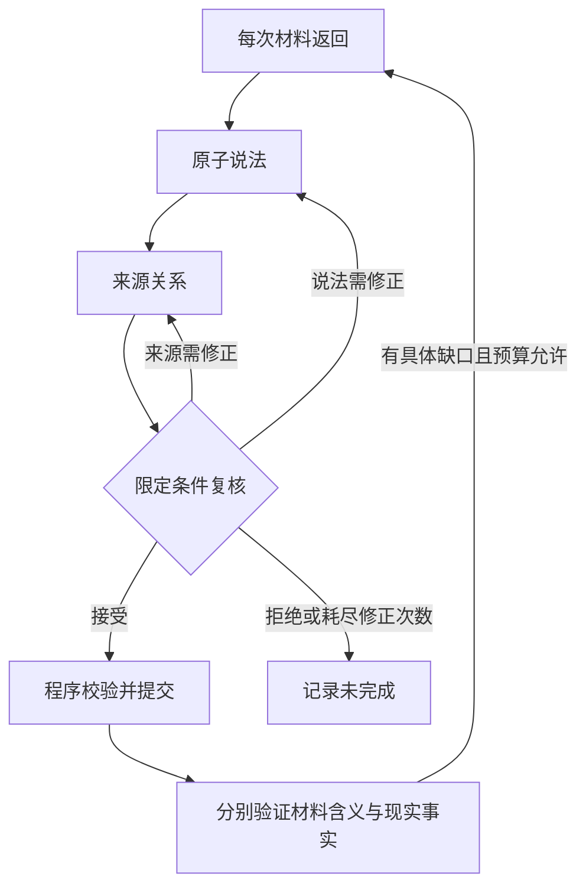

# 分阶段 ψ 与定向反馈回环

实现：`experiments/staged_semantic.py`。每次材料返回仍进入 ψ，目标文本、时间截点、证据范围保持不变。模型分阶段理解材料；程序生成编号、定位原文、登记缺口并提交通过校验的状态更新。

| 阶段 | 输入与职责 | 输出 | 不通过时 |
|---|---|---|---|
| atoms | 当前材料；主体、行为、数量/单位、时间、基准/范围、否定、条件/语气 | 至多 6 个原子说法，各有原文和限定短语 | 明确记录无效引用或结构错误 |
| lineage | 当前材料与可访问材料的标识；出处与引用方向 | 至多 4 个显式引用、可为空的原始材料角色 | 保留缺失上游为缺口，不编造来源 |
| critic | 原文、两个草稿、旧分析、与当前材料相关的验证反馈 | 接受；指定 atoms/lineage 修正；拒绝 | 带唯一原文引用和具体问题退回对应阶段 |
| 程序装配 | 被接受的两个草稿、版本与缺口登记表 | 完整现行 Analysis | 校验失败不提交；上次有效状态保留用于审计 |
| evidence | 固定证据范围内的材料与片段 | 材料支持、反驳、冲突或未确定 | 给出具体取证/重解任务 |
| world | 可访问材料、来源关系与角色 | 现实事实判断，允许未确定 | 缺口只影响对应判断层 |



图中返回某阶段表示只重做被点名的阶段，另一个草稿保留，再复核两者一致性。默认每次 ψ 至多一次定向修正；复核仍拒绝就明确失败，不把失败改成“无法判断”冒充完成。真实外层运行另有轮数和总预算限制。

提示词分别对应 `ATOMS_PROMPT`、`LINEAGE_PROMPT`、`CRITIC_PROMPT`、`EVIDENCE_PROMPT`、`WORLD_PROMPT`，完整内容与严格 JSON schema 均在实现文件中。限定短语在其所属原子说法的引用内定位：例如同一年份在文章里重复出现，只要在选中的父引用内唯一，就可确定位置。两个不同的原子说法可以引用同一句话。

稳定编号由材料版本与内容生成。新分析完整替换当前材料的分析；旧分析保留在历史中。仍有依据的发现需要重新确认，无依据的发现可以撤回。跨材料引用允许，但不同所有者的冲突定义会被拒绝；缺口登记表约束引用范围和生命周期。旧 v1 检查点缺少历史登记信息，需要重新生成 v2 的有效首轮。

开发验证计划（结果出现前固定）：

1. 先对已有开发题 p02（早期/最终质量）和 p04（温度基准期）各跑两轮，检查曾失败的分解和状态重复更新。
2. 若这两题完成并符合临时参考答案，按相同配置运行全部 8 道开发题。若失败，保存该次尝试；依据具体错误修复后在新目录重新运行，禁止覆盖失败记录。
3. 模型 `gpt-6-astra`，明确设置 `reasoning_effort=medium`；每次完成上限 4,000 token，每题最多 64 次调用、64,000 完成 token、900 秒，并发 2。模型参数和接口都变化了，结果不能用作与旧版同预算的因果优势证明。
4. 每次返回都执行分阶段 ψ；外层开发测试强制两次实际验证。每次 ψ 默认只允许一次带证据的内层修正。API 传输不自动重试，拒绝/截断/限流保留真实原因。
5. 运行时不读参考答案，完成后由独立离线脚本评分。完成率、临时标签一致率、来源和引用边指标分别报告。模型 critic 接受不等于人工审核。

这些 8 题已经用于发现问题，属于开发集，参考答案仍未获人工裁决。本次目标是把分解和反馈接口做成可运行、可检查的实现，不宣称已经证明真实新闻准确率提升。

```bash
python experiments/staged_run.py \
  --inputs experiments/proof_pilot/inputs.json \
  --cases p02,p04 --output reports/staged-dev-01 --rounds 2
python experiments/staged_score.py \
  --gold experiments/proof_pilot/gold.json --run reports/staged-dev-01
```

API 凭据通过运行环境配置；`--prompt-key` 仅在隐藏回显的交互终端使用。输出目录必须是新目录。
