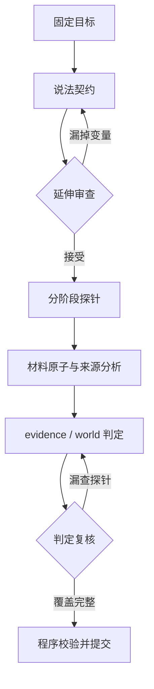

# 目标拆解与延伸判定层

这一层在读取任何新闻材料之前运行一次，把固定目标拆成可核查的说法契约，再从契约生成判定探针。探针是问题和覆盖义务，不是事实、来源或证据。

## 第一层：说法契约

`CLAIM_CONTRACT_PROMPT` 提取最多四个决定答案的子说法，并保留合取、析取、条件、例外、比较和因果方向。每个子说法必须用目标文本中的唯一原句定位；主体和谓词必填，数量与单位、时间、基准与范围、否定、条件、语气和实体身份按原文登记。编号由程序根据固定目标签名和原文位置生成，模型不能生成编号。

## 第二层：从说法延伸判定问题

`EXTENSION_PROMPT` 先复核说法契约。发现遗漏时，必须引用目标原文并定向重做一次完整契约；旧契约生成的探针全部作废。契约通过后，每条子说法至少生成语义核心与来源链探针，并按存在的变量增加极性、时间边界、数量与单位、比较基准、条件与语气、实体身份探针；现实事实判断还增加来源独立性探针。

程序为探针生成稳定编号，并决定路由：

| 探针 | 路由 |
|---|---|
| 语义、极性、时间、数量、基准、条件 | atoms → evidence |
| 实体身份 | atoms → evidence → world |
| 来源链 | lineage → world |
| 来源独立性 | lineage → world |

每个阶段只收到与自己有关的投影，所有投影共享同一个目标签名与计划校验值。计划不能包含 `basis`、`verdict` 或 `resolution`，也不能被后续阶段引用为证据。修改目标文本、时间、模式或证据范围都会使旧计划失效。

## 判定复核

evidence 和 world 各自完成后，`JUDGMENT_CRITIC_PROMPT` 检查每个延伸探针是否实质处理、结论是否与引用原文一致、是否把未解决问题误写成确定答案。若发现一个具体遗漏，只重跑被点名的 evidence 或 world 层，然后再次复核；修复预算耗尽或路由错误会显式失败。

## 验证方式

离线测试覆盖精确目标定位、必需探针覆盖、稳定编号、修改目标后拒绝复用、契约修订后删除旧探针、分阶段投影、判定定向修复、错误跨层路由、一次规划跨两轮复用、调用和用量统计。真实开发运行使用 `--target-extension`，每次运行保留计划、投影、计划历史、判定历史、检查点、响应和用量。

这一结构增加覆盖检查，但不能从逻辑上保证真实新闻正确率。正确率仍需用未见案例和独立参考答案测量；延伸层首先要证明不降低现有结果，再检查它能否在第一轮失败的困难案例上产生净修正。

