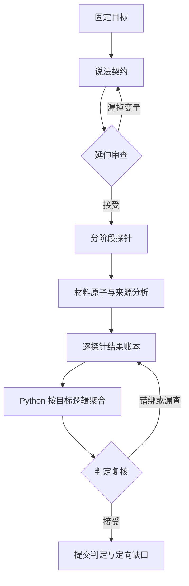

# 目标拆解与延伸判定层

这一层在读取任何新闻材料之前运行一次，把固定目标拆成可核查的说法契约，再从契约生成判定探针。探针是问题和覆盖义务，不是事实、来源或证据。

## 第一层：说法契约

`CLAIM_CONTRACT_PROMPT` 提取最多四个决定答案的子说法，并保留合取、析取、条件、例外、比较、因果与归因方向。每个子说法必须用目标文本中的唯一原句定位；主体和谓词必填，数量与单位、时间、基准与范围、否定、条件、语气和实体身份按原文登记。这是一次不可变的第一层语义合同；后续延伸只生成检查问题，不能借第二轮改写原目标。

“机构/人物报道了某事实”不是一个平面句子：它拆为“谁在何时作了报告”的 `attribution` 与“报告具体声称什么”的 `attributed_content`。程序一旦发现同一子说法含两个主体、谓词或其他必须分出角色的同类变量，就不让它直接进入延伸层，而是要求完整重拆。时间是明确例外：一个不可再拆的说法可以含多个彼此不重叠、语义独立的时间限定，例如“阿波罗时代”与“较新的月球任务数据”；它们必须保留为不同 `dimension_id`，以后分别判定，不能合并成一个宽泛时间问题。即使模型只提取了一组主体/谓词，目标中明确的 `reported that` 等嵌套归因结构也会触发同一门槛。被归因内容保存程序生成的 `parent_claim_id`，后续不能被静默提升为系统独立断言的现实事实。不同实体可以共存，但每个实体都有独立的 `dimension_id`。说法、变量编号均由程序根据固定目标签名、所有权和原文位置生成，模型不能生成编号。

## 第二层：从说法延伸判定问题

`EXTENSION_PROMPT` 先复核说法契约。发现遗漏时，必须引用目标原文并定向重做一次完整契约；旧契约生成的探针全部作废。第一层结构重拆、延伸层要求回退第一层的语义修订、以及保持第一层不变的探针集合重生成，各有一次独立预算：任一失败不能消耗另外两类唯一的纠错机会，任一预算再次超限都会明确停止。若契约已被接受、但延伸层返回了多余、缺失或错绑的探针，程序只带着同一份不可变说法契约定向重跑延伸层一次；它不能借修复探针集合之名重新解释第一层目标。关系专属探针也只能出现在同名关系逻辑下，不能把普通合取误扩成比较、条件或因果问题。

契约通过后，每条子说法至少生成语义核心与来源链探针，并按存在的变量增加极性、时间边界、数量与单位、比较基准、条件与语气、实体身份探针；现实事实判断还增加来源独立性探针。语义核心探针必须绑定主体与谓词的变量编号；变量型探针只能绑定自己负责的变量；来源型探针不绑定变量。每个时间变量必须恰好拥有一个只绑定该时间编号的 `time_boundary`，所以两个独立时间限定会产生两个问题和两份结果。多个实体也必须各自生成一个实体身份探针，不能用一个笼统问题冒充全部实体都已检查。凡是出现 `exact_designation` 的说法，还必须生成一个绑定该说法全部变量的 `designation_relation`：它检查命名或改名的施事、动作、原对象、新名称、方向和限定条件是否由材料共同建立，禁止把几个彼此无关但分别为真的事实拼成一次命名事件。

条件、比较和因果关系不能拆成“各部分分别为真”后再相乘。此类目标必须保留为一个完整关系说法，并额外生成 `conditional_relation`、`comparison_relation` 或 `causal_relation` 探针；关系探针绑定该说法的全部变量，要求材料建立方向和关系本身。`single` 只允许一个说法，`and/or` 只允许平坦独立分支，`attribution` 只允许一个报告父说法及其平坦合取内容。当前没有表达式树，因此嵌套混合逻辑 `mixed` 明确失败关闭，不用猜测性的 AND 或“全票一致”制造答案。

程序先校验探针与 `dimension_id` 的所有权和一一覆盖，再为探针生成稳定编号并决定路由。实体检查被拆为两种不同合同：`entity_identity` 使用程序固定的 `same_referent` 政策，允许精确称呼、别名、无歧义描述或指代建立同一对象；它的问题文本由程序根据目标中的实体锚点生成，模型不能把“是否同一对象”偷换成“是否担任目标所说角色”。施事、机构角色和动作归属由 `semantic_core` 检查，命名/改名方向由 `designation_relation` 检查。`exact_designation` 只在目标本身明确断言命名、改名或标题时启用。命名谓词的词法门禁覆盖 `name / rename / call / title / designate / label / term` 的常见英语词形，但只检查说法自己的谓词定位；另一处出现命名词不能把普通 `launched` 等谓词升级成精确名称断言。词边界也阻止 `unnamed`、`surname` 等子串误触发。第一层还拒绝同一出现位置内互相嵌套的实体跨度，也拒绝一个说法内出现两个无方向角色的 `exact_designation`，避免把完整专名及其内部单词或旧名/新名重复变成匿名硬门槛：

`referent_relation` 是跨字段一致性保留的策略内明细码，并非只用于普通实体。提示与 Python 使用同一张表：`semantic_constraint` 始终为 `not_applicable`；`same_referent` 的 supported 可为 `exact / alias / description / anaphora`；`exact_designation` 的 supported 只能为 `exact`。其余状态分别使用 `different`、`ambiguous` 或 `unresolved`。程序不静默改写不合法组合；一次定向结构修复仍不合规则显式停止。

| 探针 | 路由 |
|---|---|
| 语义、极性、时间、数量、基准、条件 | atoms → evidence → world |
| 条件/比较/因果关系 | atoms → evidence → world |
| 命名/改名关系 | atoms → evidence → world |
| 实体身份 | atoms → evidence → world |
| 来源链 | lineage → world |
| 来源独立性 | lineage → world |

每个阶段只收到与自己有关的投影，所有投影共享同一个目标签名与计划校验值。计划不能包含 `basis`、`verdict` 或 `resolution`，也不能被后续阶段引用为证据。修改目标文本、时间、模式或证据范围都会使旧计划失效。

## 第三层：逐探针结果与程序聚合

`decision-probe-v3` 不允许 evidence/world 模型直接选择总 verdict。每个阶段必须对投影到该阶段的每个 `probe_id` 恰好返回一次：`supported / contradicted / conflicting / unresolved`、共享引用索引、简短理由和策略内明细码。确定性校验拒绝漏项、重复项、未知编号、越界引用、无依据的确定结论以及不符合 `match_policy` 的状态—明细组合。对于确定的 `designation_relation`，还要求至少一个已定位的单句或单行依据同时包含显式命名谓词和目标中的全部精确名称；命名词与名称只散落在不同句子时不能通过。逐探针结果作为 `ProbeAssessment` 写进每轮报告，下一轮缺口也携带原始 `probe_id`。评分器仍能读取 v1/v2 历史产物，但新运行必须声明 v3，不能静默降级。

Python 先聚合同一子说法的必需变量，再按目标的 `and / or / attribution` 等受支持逻辑聚合子说法。合取中任一明确反驳即可反驳整体；析取中任一明确支持即可支持整体。完整保留的条件、比较、因果说法必须同时通过关系专属探针；命名/改名说法也必须通过绑定全部变量的 `designation_relation`。分别证明两端发生、名称存在或主体存在，都不能替代方向明确的关系证据。上述单句门禁是可复算的词法/结构完整性检查：它能挡住最简单的“散落事实拼接”，但不能证明句内的施事、方向、日期和语义都判断正确；这些仍由逐探针判断与 critic 复核，并最终需要独立标注数据测量。来源链与来源独立性只会把尚未充分认证的肯定结果降为 `unresolved`，不会伪造反驳。模型摘要和 critic 可以指出错误，但不能覆盖程序算出的结果。

回环中的旧缺口也不再永久继承最初的 `blocking`。每轮根据当前逐探针状态和整体逻辑重算：探针已有确定依据时关闭旧任务；探针仍未知但另一 OR 分支已支持（或 AND 分支已明确反驳）时，旧任务仍保留为未解决历史，却降为非阻塞，不能把已经决定的标签重新压回 `unresolved`。若以后它重新成为决定性缺口且有原始依据，程序会恢复阻塞。

共享 `basis` 数组避免为每个探针重复输出长引文；每个结果只保存引用索引，装配后转换为完整、可定位的 `Span`。因此下一次评分可分别报告：计划覆盖、实际逐探针返回率、有依据的确定结果率和最终标签，而不再把“提示词送达”冒充“探针已回答”。

## 判定复核

evidence 和 world 各自完成后，`JUDGMENT_CRITIC_PROMPT` 检查每个延伸探针是否实质处理、逐探针状态是否与引用原文一致、是否把未解决问题误写成确定答案。若发现一个具体遗漏，只重跑被点名的 evidence 或 world 层，然后再次复核；修复预算耗尽或路由错误会显式失败。输出集合本身缺项、重复或错引时使用独立的一次结构修复预算，不挤占 critic 的语义修复机会。

延伸模式还在每个 atoms / lineage 返回后执行一次确定性定位校验。所有 `quote` 与 `qualifier_quote` 只能来自 `material.content`；URL、issuer、availability 等结构化元数据不能伪装成正文引文。首次定位失败会丢弃整份草稿并定向重跑该层一次，第二次仍失败才显式停止。这一结构修复不替代后面的语义 critic。

`origin` 是整个固定目标的来源节点，不是材料中某个相似统计或旁支说法的生产者。模型给出的所有原始候选会保留在 `analysis_history` 供审计，但不能直接成为最终输出。程序从目标来源版本出发，只沿已经成立的引用、转载、翻译或派生边重建路径；在可达候选中，如果候选 A 还能沿直接传播边到达候选 B，A 只是中间节点，最终只保留 B。多个互不相连但分别可达的终端来源会同时保留；断链或没有终点的环显式留下 lineage 缺口。这样既排除旁支和中间转载者，也不会错误禁止证据范围之外、但确由引用链连接的上游原始材料。

## 验证方式

离线测试覆盖精确目标定位、嵌套归因重拆、父归因不得穿越子内容、嵌套实体拒绝、同一指称与角色断言分流、程序所有的身份问题、多个独立时间限定及逐时间探针、同一指称与精确命名分流、改名词形、谓词局部词法门禁、重复精确名称拒绝、命名方向关系全变量绑定、关系专属探针、精确名称状态—明细码映射、三类目标规划修复的双向预算隔离、多实体独立编号与探针、错误变量绑定拒绝、必需探针覆盖、稳定编号、修改目标后拒绝复用、计划校验与投影防篡改、契约修订后删除旧探针、分阶段投影、逐探针结果完整性、程序逻辑聚合、旧阻塞缺口重算、判定定向修复、错误跨层路由、终端来源投影、平行来源保留、断链和环失败关闭、一次规划跨两轮复用、调用和用量统计。真实开发运行使用 `--target-extension`，每次运行保留计划、投影、计划历史、逐探针结果、判定历史、检查点、响应和用量；失败摘要还保留清理后的语义阶段与稳定错误码，避免把协议失败误记为标签错误。

这一结构增加覆盖检查，但不能从逻辑上保证真实新闻正确率。正确率仍需用未见案例和独立参考答案测量；延伸层首先要证明不降低现有结果，再检查它能否在第一轮失败的困难案例上产生净修正。
