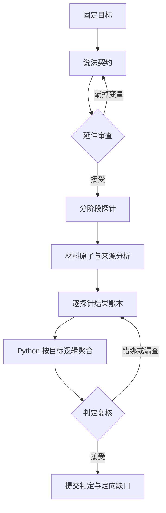

# 目标拆解与延伸判定层

这一层在读取任何新闻材料之前运行一次，把固定目标拆成可核查的说法契约，再从契约生成判定探针。探针是问题和覆盖义务，不是事实、来源或证据。

## 第一层：说法契约

`CLAIM_CONTRACT_PROMPT` 提取最多四个决定答案的子说法，并保留合取、析取、条件、例外、比较、因果与归因方向。每个子说法必须用目标文本中的唯一原句定位；主体和谓词必填，数量与单位、时间、基准与范围、否定、条件、语气、实体身份、施事角色与地点按原文登记。模型仍需返回兼容字段 `statement`，但程序会用已定位的 `anchor.quote` 覆盖它；模型不能通过自由改写改变 immutable target。这是一次不可变的第一层语义合同；后续延伸只生成覆盖义务，不能借第二轮改写原目标。

“机构/人物报道了某事实”不是一个平面句子：它拆为“谁在何时作了报告”的 `attribution` 与“报告具体声称什么”的 `attributed_content`。程序一旦发现同一子说法含两个主体、谓词或其他必须分出角色的同类变量，就不让它直接进入延伸层，而是要求完整重拆。时间是明确例外：一个不可再拆的说法可以含多个彼此不重叠、语义独立的时间限定，例如“阿波罗时代”与“较新的月球任务数据”；它们必须保留为不同 `dimension_id`，以后分别判定，不能合并成一个宽泛时间问题。即使模型只提取了一组主体/谓词，目标中明确的 `reported that` 等嵌套归因结构也会触发同一门槛。被归因内容保存程序生成的 `parent_claim_id`，后续不能被静默提升为系统独立断言的现实事实。不同实体可以共存，但每个实体都有独立的 `dimension_id`。说法、变量编号均由程序根据固定目标签名、所有权和原文位置生成，模型不能生成编号。

## 第二层：从说法延伸判定问题

`EXTENSION_PROMPT` 先复核说法契约。发现遗漏时，必须引用目标原文并定向重做一次完整契约；旧契约生成的探针全部作废。第一层结构重拆、延伸层要求回退第一层的语义修订、以及保持第一层不变的探针集合重生成，各有一次独立预算：任一失败不能消耗另外两类纠错机会，任一预算再次超限都会明确停止。若契约已被接受、但延伸层返回了多余、缺失或错绑的探针，程序只带着同一份不可变说法契约重跑延伸层；它不能借修复探针集合之名重新解释第一层目标。

v4 在延伸输入中加入程序生成的 `coverage_segments`。程序用目标原文位置确定性标出 number、date、negation、modality、condition、designation、attribution、location、logic connector 与剩余 context；模型必须在 `coverage_ledger` 中对每个 `segment_id` 恰好分类一次。高信号片段只有被重叠且类型相容的 dimension 覆盖才可标为 `covered_by_dimension`，否则必须标为 `suspected_missing` 并退回第一层重拆。这个账本能机械发现已枚举显式线索的可疑漏项，但不能证明自然语言所有隐含含义都已覆盖。

契约通过后，每条子说法必须有一个只绑定 predicate 的 `predicate_core`、一个不绑定 dimension 的 `source_lineage`，以及每个已登记变量自己的正交探针：极性、单个时间边界、单个数量与单位、单个比较基准、单个条件或语气、单个实体身份、单个施事角色、单个地点。现实事实判断另有 `source_independence`。每个时间、身份、角色和地点 dimension 都分别产生问题和结果，不能用一个笼统问题合并。

每条子说法还必须恰好有一个 composition gate，而不是让 predicate 探针兼任组合判断。程序按合同选择其中一种：被归因内容使用 `attribution_relation`；明确命名或改名使用 `designation_relation`；条件、比较、因果逻辑分别使用对应 relation；其余使用 `claim_composition`。composition gate 绑定说法全部 dimensions（归因内容的定向父子关系例外地不绑定 dimension），检查这些部分是否共同构成目标断言。各部分分别为真不能替代关系、方向或组合本身。

`entity_identity`、`actor_role` 与 `location` 是三个独立问题：前者用 `same_referent` 检查材料是否指向同一对象；第二个检查谁以目标所断言的施事或机构角色行动；第三个检查断言适用的地点。`predicate_core` 只负责谓词，不能吞并这三类职责。`exact_designation` 只在目标明确断言名称或标题时启用；命名方向仍由 `designation_relation` 检查。v2/v3 历史计划曾以 `semantic_core` 合并主体—谓词责任；v4 新计划不再把它作为必需探针。

所有 probe 的 `question` 与 `decision_impact` 都由程序根据冻结锚点、kind 与绑定生成；模型返回的兼容文本会被丢弃。程序校验 `dimension_id` 所有权、所需 binding 与 exactly-one composition gate 后才生成稳定 `probe_id`。`referent_relation` 的固定映射不变：`semantic_constraint` 始终为 `not_applicable`；`same_referent` 的 supported 可为 `exact / alias / description / anaphora`；`exact_designation` 的 supported 只能为 `exact`。不合法的状态—明细组合不会被静默改写。

| v4 探针 | 路由 |
|---|---|
| predicate、composition、极性、时间、数量、基准、条件/语气 | atoms → evidence → world |
| actor role、location、entity identity、exact designation | atoms → evidence → world |
| attribution/designation/conditional/comparison/causal relation | atoms → evidence → world |
| source lineage | lineage → world |
| source independence | lineage → world |

每个阶段只收到与自己有关的投影，所有投影共享同一个目标签名、计划校验值和 deterministic coverage ledger。计划不能包含 `basis`、`verdict` 或 `resolution`，也不能被后续阶段引用为证据。修改目标文本、时间、模式或证据范围都会使旧计划失效。

## 第三层：逐探针结果与程序聚合

`decision-probe-v4` 不允许 evidence/world 模型直接选择总 verdict。每个阶段必须对投影到该阶段的每个 `probe_id` 恰好返回一次：`supported / contradicted / conflicting / unresolved`、共享引用索引、简短理由和策略内明细码。确定性校验拒绝漏项、重复项、未知编号、越界引用、无依据的确定结论以及不符合 `match_policy` 的状态—明细组合。逐探针结果作为 `ProbeAssessment` 写进每轮报告。

v4 还把“探针送到了 atoms/lineage”变成可观察合同。每份材料的 atoms 与 lineage 输出都必须为其阶段投影中的每个 probe 返回一个 `probe_check`：`addressed / absent / ambiguous`、指向本次 findings 的索引及理由。atoms 不能冒用 origin；lineage 只有确实返回 origin 时才能设置 `origin_used=true`。每个 atom 或 citation 也必须至少被一个 probe_check 使用，防止无关发现躲在账本之外。这里记录的是当前材料是否产生相关发现，不是真假判定。

每个 evidence/world 的 unresolved probe 必须二选一：提交一个带具体原文 lead 的 `fetch / search / reanalyse` 任务，或提交一个 `reason=no_source_lead` 的停止项。不能同时提交，也不能两者都不交。程序把停止项保存为 `ProbeStop`；已有任务只有在新一轮逐探针结果、显式 resolution 或该 probe 的停止项满足合同后才改变状态。因此“无新线索”不会被伪装成确定结论，下一轮任务也继续携带原始 `probe_id`。

v2/v3 计划、旧 atoms/lineage schema 和旧报告仍可由兼容分支读取；它们不获得 v4 ledger、per-probe material checks 或严格 follow-up 的语义。新的 `--target-extension` 开发实验要求 `decision-probe-v4`，schema 不符会在写运行产物前失败，不能静默降级。

Python 先聚合同一子说法的必需变量，再按目标的 `and / or / attribution` 等受支持逻辑聚合子说法。合取中任一明确反驳即可反驳整体；析取中任一明确支持即可支持整体。完整保留的条件、比较、因果说法必须同时通过关系专属探针；命名/改名说法也必须通过绑定全部变量的 `designation_relation`。分别证明两端发生、名称存在或主体存在，都不能替代方向明确的关系证据。上述单句门禁是可复算的词法/结构完整性检查：它能挡住最简单的“散落事实拼接”，但不能证明句内的施事、方向、日期和语义都判断正确；这些仍由逐探针判断与 critic 复核，并最终需要独立标注数据测量。来源链与来源独立性只会把尚未充分认证的肯定结果降为 `unresolved`，不会伪造反驳。模型摘要和 critic 可以指出错误，但不能覆盖程序算出的结果。

回环中的旧缺口也不再永久继承最初的 `blocking`。每轮根据当前逐探针状态和整体逻辑重算：探针已有确定依据时关闭旧任务；探针仍未知但另一 OR 分支已支持（或 AND 分支已明确反驳）时，旧任务仍保留为未解决历史，却降为非阻塞，不能把已经决定的标签重新压回 `unresolved`。若以后它重新成为决定性缺口且有原始依据，程序会恢复阻塞。

真实任务路由实验使用 `task_routed` provider：首轮只把 `target.source_version_id` 包成 `RetrievalHit`，并只归因给本轮 initial origin task；后续 `fetch` 只按完整 URL 或 version 命中、`reanalyse` 只按 version 命中、`search` 使用冻结的确定性词法路由。每份返回只携带本轮实际命中的 task IDs；未命中任务进入 `last_feedback`，状态为 `corpus_exhausted`，provider 不会无条件返还全部 corpus。这个模式与每轮重放同一 eligible corpus 的 `fixed_reanalysis` 控制臂分开，不能混作同一个实验。

共享 `basis` 数组避免为每个探针重复输出长引文；每个结果只保存引用索引，装配后转换为完整、可定位的 `Span`。因此下一次评分可分别报告：计划覆盖、实际逐探针返回率、有依据的确定结果率和最终标签，而不再把“提示词送达”冒充“探针已回答”。

## 判定复核

evidence 和 world 各自完成后，`JUDGMENT_CRITIC_PROMPT` 检查每个延伸探针是否实质处理、逐探针状态是否与引用原文一致、是否把未解决问题误写成确定答案。若发现一个具体遗漏，只重跑被点名的 evidence 或 world 层，然后再次复核；修复预算耗尽或路由错误会显式失败。输出集合本身缺项、重复或错引时使用独立的一次结构修复预算，不挤占 critic 的语义修复机会。

延伸模式还在每个 atoms / lineage 返回后执行确定性定位与 probe ledger 校验。所有 `quote` 与 `qualifier_quote` 只能来自 `material.content`；URL、issuer、availability 等结构化元数据不能伪装成正文引文。`probe_checks` 必须与本阶段投影一一对应，finding 索引、origin 使用和覆盖集合也必须有效。首次失败会丢弃整份草稿并定向重跑该层一次，第二次仍失败才显式停止。这一结构修复不替代后面的语义 critic。

`origin` 是整个固定目标的来源节点，不是材料中某个相似统计或旁支说法的生产者。模型给出的所有原始候选会保留在 `analysis_history` 供审计，但不能直接成为最终输出。程序从目标来源版本出发，只沿已经成立的引用、转载、翻译或派生边重建路径；在可达候选中，如果候选 A 还能沿直接传播边到达候选 B，A 只是中间节点，最终只保留 B。多个互不相连但分别可达的终端来源会同时保留；断链或没有终点的环显式留下 lineage 缺口。这样既排除旁支和中间转载者，也不会错误禁止证据范围之外、但确由引用链连接的上游原始材料。

## 验证方式

离线测试覆盖 immutable target 定位、嵌套归因重拆、deterministic segment ledger、可疑漏维度回退、program-owned probe 文本、`predicate_core` 与 exactly-one composition gate、时间/身份/角色/地点正交、per-probe atoms/lineage checks、逐探针结果完整性、unresolved task XOR `no_source_lead`、旧阻塞缺口重算、严格 `RetrievalHit` 归因、精确 fetch/reanalyse、确定性 lexical search、未知任务 corpus feedback、固定控制臂与 task-routed 回环分离、终端来源投影、断链和环失败关闭、调用和用量统计。真实开发运行保留计划、coverage ledger、阶段投影、planner 与 ψ 历史、逐探针结果、probe stops、retrieval attribution、判定历史、检查点、响应和用量。

这些测试证明结构合同、路由归因和回环行为可以复算，不证明新闻标签更正确。正确率仍需用未见案例、独立参考答案和预先固定的评分方法比较 `v4_fixed_reanalysis` 与 `v4_task_routed`；开发集跑通、critic 接受、token 增减或输出更短都不能替代该测量。
