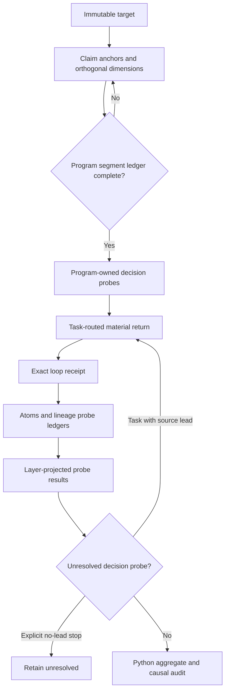

# Target extension v4: frozen comparison protocol

This protocol separates semantic coverage from retrieval-loop benefit. It must
be frozen with code hashes before any v4 model call. Gold labels are read only
by the offline scorer after inference artifacts are complete.

## Questions under test

1. **Fixed-material regression:** with the same eligible snapshots exposed on
   every round, does v4 preserve or improve the frozen labels and documentary
   roots relative to the retained original, staged and v2 runs?
2. **Task-routed loop:** when round one receives only the immutable target
   source, does each later returned snapshot have a validated current-round
   task attribution, pass through atoms and lineage again, and produce a net
   round-one-to-final result without a label break? Corrections are reported,
   but a minimum correction count is not imposed after seeing the cases.
3. **Contract execution:** did the system actually execute the intended
   target segmentation, per-material probe ledger, per-judgement probe results,
   strict follow-up XOR rule and task-to-hit routing? A prompt being present or
   a model call being counted is not execution evidence.

The two provider modes answer different questions and are not pooled into one
accuracy number. `fixed_reanalysis` is the material-exposure control.
`task_routed` is the loop-mechanism test.

The frozen configuration records retrieval mode `legacy` for fixed reanalysis
and `strict` for task routing. Runtime reports use `legacy-compatible` and
`strict`, respectively; the gates require these exact mode pairs.

## v4 mechanism

The first layer retains exact target quotations. Python replaces advisory
model statements with those quotations, generates probe questions and decision
impacts, owns IDs/routes/gates, and hashes the complete plan. v4 separates:

- predicate from full-claim composition;
- same referent from actor/agent role;
- location from entity identity;
- each time, quantity/unit, baseline/scope, condition and modality anchor;
- attribution, designation, conditional, comparison and causal direction;
- source lineage and, for world claims, source independence.

Each claim has one `predicate_core` probe and exactly one full-composition gate.
It cannot use legacy `semantic_core`. Every deterministic target segment is
classified exactly once; high-signal cues cannot be dismissed as context.

Every atoms and lineage response has one material-level slot for each projected
probe. Every evidence and world response has one judgement slot for each
projected probe. Each unresolved judgement probe has exactly one concrete,
source-backed retrieval task or one explicit `no_source_lead` stop. Every
strict provider return names only tasks issued in that round, and every return
is saved before it is decomposed again. Every issued task has exactly one
terminal outcome: participation in at least one attributed hit, or one
validated `corpus_exhausted` record, never both.

For every strict return the runner freezes a `loop-receipt-v1` before calling
the semantic stages. The receipt binds the immutable target, returned version,
ordered task snapshots, task and probe IDs, and the previous accepted result
for those exact probe slots. The identical receipt must appear in the retained
atoms, lineage and critic request payloads. Evidence and world receive only the
projection for their own layer in `current_round_receipts`; the judgement
critic receives no routing receipt. Dependency revisits receive an explicit
empty receipt. Receipts are routing context, never documentary evidence or a
substitute for a quoted basis.

The fixed arm uses `max_rounds=2` with `experimental_force_rounds=true` and
must retain exactly two verification cycles. The routed arm uses the same cap
with `experimental_force_rounds=false`. It may stop after one verification when
there is no active blocking gap, or after a second search with no hit when every
issued task has a retained `corpus_exhausted` outcome. A second accuracy
verification is valid only when a round>1 frozen probe-owned `fetch` or `search`
task returns a previously unseen eligible version and the operations ledger
exactly joins that task and probe through attribution → save → decompose →
verify. A provenance-only hit may still update psi and the graph, but cannot
trigger the accuracy verifier. A duplicate or explicit `reanalyse` is an
interpretation repair, not novel evidence and not a real second pass. If the
two-round cap ends after only such a return, the round-1 unresolved result is
retained with `no_probe_owned_novel_evidence`. `search` and `fetch` exclude seen
versions; only an explicit `reanalyse` task may request one.

Within one evidence/world probe slot, a newly emitted follow-up ID atomically
supersedes the prior active task. The old definition remains in registry and
history, the operation ledger records the exact old→new transition, and no
Resolution is fabricated. Superseded IDs are permanent tombstones, including
after checkpoint resume; the same probe ID in the other layer is a distinct
slot.

## Arms and paired comparisons

| Arm | Provider | Comparison purpose |
|---|---|---|
| Retained original | Frozen historical snapshots | Original reference |
| Retained staged | Frozen historical snapshots | Pre-extension reference |
| Retained v2 | Fixed reanalysis | Known extension reference and defects |
| v4 fixed control | Fixed reanalysis | Isolate v4 semantic-contract regression |
| v4 routed loop | Task-routed frozen corpus | Test real gap-to-retrieval-to-reanalysis loop |

For the routed arm, round 1 and final are compared within the same run and
checkpoint chain. This avoids treating two independently sampled model runs as
the second-loop effect. It still does not equal a randomized causal estimate:
round 2 has more information and compute by design.

## Mechanical gates

Before a paid smoke:

- all offline tests pass;
- current code, tests, inputs, provisional gold and retained comparison
  artifacts match the Freeze-12 hashes with no skipped file;
- the independent scorer and both gates reject malformed v4 plans, altered
  questions, incomplete segment ledgers, missing material slots, unresolved
  probes without exactly one follow-up outcome, unattributed returns, task IDs
  not issued in that round, forged second-pass driver IDs, duplicate versions
  presented as novel evidence, and superseded task-ID reactivation;
- no credential appears in source, reports or call records.

The credential gate scans frozen source, inputs, baselines, prior artifacts and
run artifacts for common token shapes. Its findings contain only file paths and
detector names, never the matched value. Safe environment injection remains an
operator prerequisite that a filesystem snapshot alone cannot prove.

The smoke runs p04, p07 and p08 with one worker because they cover paired quantities/baselines,
actor-versus-identity plus designation direction, and two independent time
qualifiers plus an intermediate source. Any call error, protocol error,
unexpected model, missing required adaptive outcome, synthetic verification,
label break, wrong root/edge, or v4 audit failure preserves that directory and
stops the full run. At least one routed smoke case must demonstrate a later
probe-owned `fetch/search` hit on a previously unseen version followed by a
real second verification; otherwise the run cannot claim that the loop
mechanism was exercised.

Only a passed smoke authorizes a new all-eight run under the exact frozen
configuration. Failed directories are never overwritten or selectively
completed.

## Reported metrics

Report the denominator and failures, not only completed cases:

- scheduled/completed/protocol-failed cases;
- three-class label accuracy and pairwise fixes/breaks;
- round-1-to-final fixes/breaks in the routed arm;
- corpus-relative terminal-origin and direct-edge precision/recall;
- exact target-segment and required-probe coverage;
- atoms/lineage material-slot coverage and finding-use coverage;
- evidence/world result-slot and grounded-conclusive coverage;
- unresolved task-or-stop coverage;
- issued-task outcome and returned-hit attribution coverage;
- loop-opportunity cases, generic second-pass cases, probe-owned novel
  second-pass cases, later probe-owned tasks and later probe-owned hit tasks;
- round-to-round probe semantic deltas, basis drift, graph-traced deltas and
  label changes with decisive traced deltas;
- retained-call receipt joins: exact request digests, direct semantic-stage
  receipt delivery, layer-projected second-pass delivery and cross-layer leaks;
- calls, input/output/reasoning/visible tokens and service seconds, reported as
  resource diagnostics only.

## Claim boundary

Passing the eight previously seen, purposive development cases can demonstrate
that the v4 contract ran, repaired the known defects and did not regress this
fixed corpus. It cannot establish general news accuracy. A general accuracy
claim additionally needs event-disjoint held-out cases, independently frozen
adjudication, repeated runs, fixed budgets and paired uncertainty intervals.
