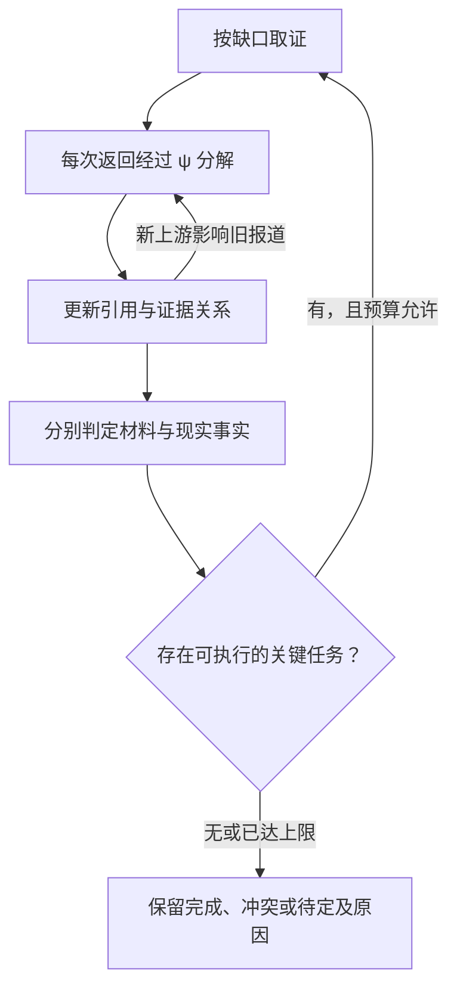

# v0.3：逐项修复与 Astra 实测

> 历史结果说明：本报告及其 33 条 API 响应生成于 PR #1 当前 `staged-validation-v2` 七阶段回环之前。它们保留为早期 monolithic v0.3 基线，不能用来证明当前分阶段提示词、逐维 TargetPlan 或新任务回执协议的准确率。当前改动只完成了离线结构与回归验证，尚未重新运行真实模型评测。

2026-09-05。基于 GitHub 固定提交 `aca102cfe13379c5924a5ffa7b60337351e4eaaa` 修复。

**已完成两轮工程复查，103 项回归测试通过，包安装验证通过。本轮共取得 33 条真实 `gpt-6-astra` API 响应。** 五个冻结的合成契约样例，第一轮判断命中 4/5，继续取证后的结果命中 5/5；没有把原先正确的四题改错。它们是定向回归样例，不是独立审定的真实新闻准确率。

## 问题与修复

| 原问题 | 已实施修复 | 验证 |
|---|---|---|
| 按材料判断与现实核实混在一起 | Target 固定 assessment_mode 和 evidence_scope；同时输出 evidence/world 两层判断 | 材料反驳报道可以判 contradicted，现场未核实仍保留 unresolved |
| 任意验证缺口覆盖整个结论 | 缺口区分 dimension、blocking、目标、依据与影响；只影响对应判断 | 关键缺口仍能阻止肯定结论；旁支缺口不会清空其他层结果 |
| 原版与 Accuracy 使用不同的最终裁决权限 | 单轮检查点与完整回环都调用同一确定性标签映射，无额外模型格式化改判 | 第一轮实际结果可逐题与后续记录比较 |
| 新缺口没有对应取证动作 | SnapshotSearchProvider 按 URL、查询或重分析任务执行，并记录覆盖不足 | 链式案例补到了之前未拿到的上游材料；空结果不会再重复验证旧输入 |
| 措辞变化、自引用整理也能延长回环 | 进展比较排除自由改写、生成 ID 和问题措辞；关键限定通过原文 span 表达；自身重访去重 | 改写不会无限延长回环；自引用不再生成“缺少新闻证据”的任务 |
| 未来材料可能污染有状态分解器 | 对排除版本做隔离的存档分解 | 每次材料返回仍有记录和分解，语义插件不会收到未来版本 |
| 分解片段的父节点可能悬空 | 校验片段在本次分析中沿父节点无环地连接当前目标 | 错目标、悬空父节点及循环被拒绝 |
| 实测发现：模型忘了重拆已经获得上游的旧报道 | 调度器在上游到达时匹配旧引用 locator，自动安排旧报道经过 ψ；不会直接把引用升级为已证实 | 第二轮工程复查补齐了图书馆和链式案例的来源路径 |

## 实测定义

两个先前的旧样例及其分数没有改动。此次另行冻结了五条**任务定义明确的合成契约样例**。四条评估指定材料的支持/反驳关系，一条评估现实事实是否有足够依据。输入与答案分开，哈希在 `experiments/frozen-v03.json`；运行后再次核对一致。

第一轮基线是同一次真实运行的第一轮检查点，不是单独重新抽样的另一套答案。回环最多五轮，模型调用、输出 token 和时间上限保持一致；实际消耗可以不同。另为链式案例运行了一次“最初就给全材料”的对照。

本次没有重新执行原版 NewsTracingAgent，不能把这里的 4/5、5/5 与上一轮 50%、0% 当作同一任务的连续性能曲线。它们用于检查已定位问题是否被修复，以及额外取证是否有用。

## 最终代码的逐题结果

| 固定任务 | 第一轮 | 继续回环后 | 来源路径状态 | 实际验证次数 |
|---|---|---|---|---:|
| 桥梁通知是否支持“已经开放” | 假/反驳 | 假/反驳 | 库内原始材料路径完成 | 1 |
| 图书馆通知是否支持“9 点关门” | 真/支持 | 真/支持 | 库内原始材料路径完成 | 1 |
| 实验室链式材料是否支持“8 点开门” | 未确定 | 真/支持 | 库内原始材料路径完成 | 2 |
| 两份渡轮材料对“今天运营”的关系 | 冲突 | 冲突 | 部分来源，未强行确立原始性 | 1 |
| 图书馆实际营业事实是否核实 | 未确定 | 未确定 | 出处路径完成，现实事实仍待定 | 1 |

每题最多允许五轮；实际在完成或证据库耗尽后停止，检索轮数为 1–2，验证次数为 1–2。上游到达触发的旧版本分解发生在同一轮内，因此分解次数可以多于材料版本数。链式案例实际做了 4 次分解、2 次验证。

链式案例的全材料单轮对照也得到“支持”。因此，这一题的增益能由**增加了可访问证据**解释；这次没有证明在同样的完整证据上，单纯重复思考提升了准确率。

世界事实与材料判断保持区分：出处路径完成，不自动意味着该发布者说的事已经在现实中得到核实。最后一题保留未知符合它的固定任务定义。

## 两轮工程复查及实际用量

| 工程尝试 | 完成情况 | 新 API 响应 | 明确复用的响应 | 第一轮/最终标签命中 |
|---|---:|---:|---:|---|
| live-v03-attempt-01 | 6/6（含全材料对照） | 23 | 0 | 4/5 → 5/5 |
| live-v03-attempt-02 | 6/6（含全材料对照） | 10 | 17 | 4/5 → 5/5 |

第一次实测的事实/材料分层已工作，但图书馆与链式案例的来源路径仍不完整。复查定位到“模型遗漏重访请求”，随后增加上游到达时的确定性调度触发，并完成第二次检查。两次输出和各自执行的代码快照均保留。

第二次仅对同案例、同变体、相同模型/提示/结构化 schema/单次输出上限的请求复用原始响应；变化后的请求重新调用 API。复用记录保留原 API 响应 ID，历史 token 和时间计入逻辑预算，实际新增请求另行计数。这不是第二次完全独立的新样本。

两次按 API 响应 ID 去重共 33 条，均返回模型 ID `gpt-6-astra`，对应输入 **57,956 token**、输出 **27,432 token**。没有保存 API 密钥，也没有自动重试到取得更高分。

第二次完整回环各题的逻辑调用数依次为：桥梁 4、图书馆 4、链式 6、冲突 3、现实未知 4；全材料单轮对照 6。时间包含被复用请求的历史耗时，不能当成第二次独立运行的纯墙钟延迟测量。详见 `repair-summary-v03.json` 和每题调用记录。

## 验证与适用边界

- 原有 76 项测试仍通过，新增 27 项针对已发现缺口和新接入路径的测试，共 103 项通过；测试中使用的语义输出替身与上述真实 API 记录分开保存。
- 在独立目录安装了 0.3.0 包，导入安装产物并运行原示例，得到预期 contradicted，错误列表为空。
- 固定材料索引能执行任务，但尚未连接开放互联网新闻采集器。库外信息不足会明确返回能力限制，不会假装已经找到证据。
- 这五题由开发者编写，没有独立审定或隐藏集。五题全对不能证明真实新闻准确率达到 100%。本轮也没有伪造概率分布或补出 NVScore 总分。
- 关键缺口的相关性、原始材料判断、引文蕴含与现实事实判断仍由语义插件提供。结构约束和回环不能保证模型永不出错。

运行命令和 API 契约见 `../docs/REPAIR_V0.3.md`。旧文档、旧诊断和旧失败保留；这里记录的是修复后的实际行为与局限。
