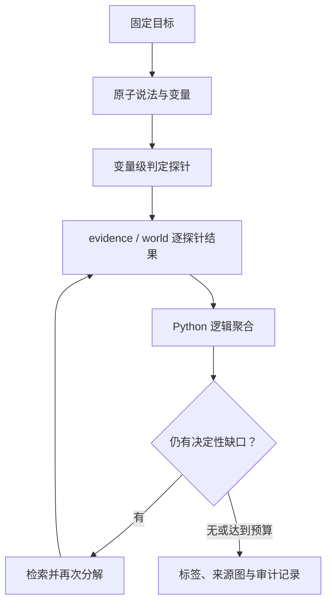

# Target-extension v2 development results

## 结论

Freeze-10 的三例 smoke 与八例 development run 均完整执行。八例最终标签与暂定参考答案一致，但 original、staged 和 target-extension 三组都是 8/8，且 target-extension 的第一轮已经是 8/8，第二轮没有修正或破坏任何 case-level 标签。因此这次运行证明的是 **v2 可执行、计划与逐探针账本完整、若干已知回归已修复**，不是总体正确率提升。

## 运行合同

- 模型：`gpt-6-astra`，`medium` reasoning。
- 固定材料快照；每例两轮，第二轮为实验性强制回环。
- 每例最多 64 calls、64k output tokens、单次 4k output tokens、900 秒。
- 单 worker；SDK transport retries 为 0。
- target structure、target semantic extension、target output、material structure、material semantic、judgement semantic 与 probe-result structure 各自拥有独立的一次修复预算。
- 源码与合同由 `experiments/target-extension-freeze-10.json` 的 21 个 SHA-256 固定；运行目录保存 executed-code 快照。

## Smoke-06

| 指标 | 结果 |
|---|---:|
| 计划案例 | 3（p02、p07、p08） |
| 完成 / 执行错误 | 3 / 0 |
| 暂定标签一致 | 3/3 |
| Freeze gate | 40/40 |
| Calls | 73 |
| Input / output tokens | 300,225 / 33,877 |
| Reasoning / visible output tokens | 4,417 / 29,460 |
| 累计 service seconds | 595.219 |
| 首轮到最终 fixes / breaks | 0 / 0 |

三例的标签均首轮即得到并保持：p02 `false → false`、p07 `false → false`、p08 `true → true`。94/94 逐探针结果槽位存在；88 个确定性结果都有 scope-valid 精确引文。后者是结构落地率，不是语义正确率。

## Full development comparison

| 指标 | Original | Staged | Target extension v2 |
|---|---:|---:|---:|
| 完成 | 8/8 | 8/8 | 8/8 |
| 暂定标签一致 | 8/8 | 8/8 | 8/8 |
| 首轮→最终 fixes / breaks | n/a | 0 / 0 | 0 / 0 |
| Corpus-relative origin precision / recall | .75 / 1.00 | .75 / 1.00 | .75 / 1.00 |
| Direct edge precision / recall | 无原生导出 | 1.00 / 1.00 | 1.00 / 1.00 |
| Calls | 136 | 142 | 168 |
| Input tokens | 183,181 | 256,050 | 700,046 |
| Output tokens | 88,752 | 33,836 | 74,243 |
| Service seconds | 1,529.986 | 729.972 | 1,323.050 |

Target-extension 相对 staged 多 26 calls、443,996 input tokens、40,407 output tokens和 593.079 累计 service seconds；标签与来源图总分没有提升。相对 original，它多 32 calls 与 516,865 input tokens，少 14,509 output tokens，并少 206.936 累计 service seconds。累计 service time 是各请求耗时之和，不是端到端墙钟时间。

v2 共固定 13 个 claims、66 个 dimensions、68 个 probes；required probe 68/68、stage projection 258/258、executed route 190/190。16/16 判定周期保留 244/244 结果，其中 supported 182、contradicted 36、unresolved 26、conflicting 0；218 个确定性结果都有合法 basis。这些数字证明覆盖与可审计性，不能单独证明解释正确。

## 已验证的修复

1. p07 不再因 `exact_designation=supported` 搭配非法 `referent_relation=not_applicable` 而停止；两轮均按合同返回 `supported/exact`，并由完整 `designation_relation` 与日期探针得到 `false`。
2. p08 的普通同一指称不再被升级为逐字标题义务；`same_referent` 可由明确 description 支持，标签从早期 v1 的错误 `unverifiable` 回到暂定参考 `true`。
3. p04 的 NASA 旁支材料 m08 没有从 NOAA 目标源出发的传播路径，最终不再被导出为该目标的 root；所有判定 basis 均来自 m07。
4. 计划、逐探针结果、repair 计数、模型返回、使用量与停止原因都保存为可复算记录。执行错误不会被偷换为 `unverifiable`。

## v2 暴露的残留缺陷

1. **中间来源冒充 root。** p08 同时导出 m14 与 m15；暂定 gold 只接受上游 m15，因此 origin precision 为 3/4=.75。m14 可以保留为 raw candidate/source record，但不应和它明确引用的终端 documentary root 并列导出。
2. **identity 与 actor role 混合。** p07 的 NOAA identity 问句仍带有“作为改名施事者”的职责。identity 应只测同指，actor-action 绑定应仅由 `semantic_core` / `designation_relation` 判断。
3. **两个时间限定曾被合并。** p08 的 `Apollo-era` 与 `newer lunar-mission data` 是两个可独立真假变化的变量；v2 合成一个 time probe，无法精确归属缺口。

v3 的修复合同因此是：从可达候选中只导出终端 roots；由程序生成纯 identity 问句；允许同一 claim 拥有多个独立 time dimensions，并为每个 time ID 单独生成 `time_boundary`。历史 v1/v2 artifacts 继续按各自 schema 读取，不能被新合同追溯性改判。

## 证明边界

- 八例都是已经看过的、目的性选择的 development cases；参考标签经 AI 复核但没有独立人工裁定。
- 三组都已达到 8/8，数据集存在明显天花板，无法测出净提升。
- 两轮使用相同固定材料，且第二轮被强制运行；`round_budget` 不等于自然收敛。
- 逐探针没有独立 gold，内部从 supported 变 unresolved 不能自动叫“修正”，反之也不能自动叫“下降”。
- 固定快照不能替代开放网络检索、来源失效、时间更新与对抗转载链测试。
- 因此可陈述：**v2 无标签回归、执行与覆盖合同通过，并修复了已知案例。** 不可陈述：**多轮或 target extension 已证明提高真实新闻正确率。**

后续要证明提升，必须冻结一个未见、独立裁定且包含困难最小对照对的 benchmark，并在相同实际预算下比较 case-level fixes、breaks、abstention、root/edge precision-recall 与成本。
